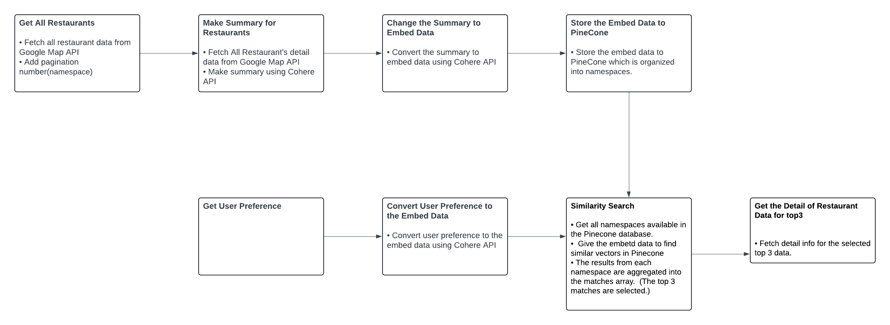
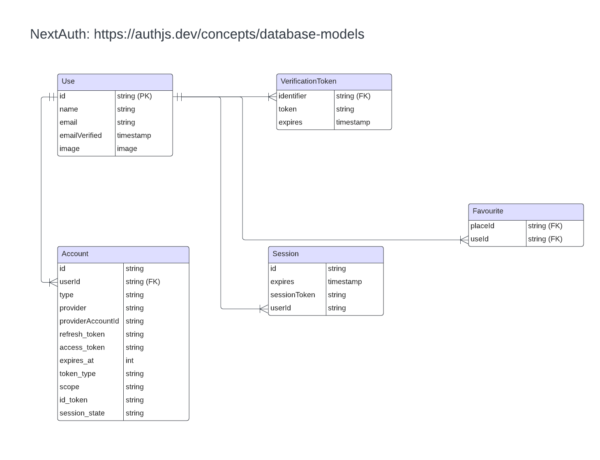

<!-- PROJECT LOGO -->

  
  <h1>AI Gourmet Navigator</h1>
  

    <a href="https://ai-gourmet-navigator.vercel.app/">View Live Demo</a>
  

<!-- TABLE OF CONTENTS -->

  
Table of Contents

    
<a href="#About-The-Project">About The Project</a>

        
<a href="#Team Members">Team members</a>

    
<a href="#Built-With">Built With</a>

    
<a href="#Getting-Started">Getting Started</a>

    
<a href="#Main-Features">Main Features</a>

    
<a href="#how-we-organize-restaurant-data">How we organize restaurant data</a>

    
<a href="#database-diagram">Database Diagram</a>

## About The Project

> AI Gourmet Navigator is a web application designed to allow users to search for restaurants in Vancouver, based on their current mood.  
> It provides a user-friendly interface for browsing, searching, and adding favorites.

 

## Team Members

<table>
  <tr>  
    <td align="center">
      <a href="https://github.com/Lada496">
         
        
          <b>Yuko Murayama</b> 
          <b>Frontend Developer</b>
        
      </a>
    </td>
    <td align="center">
      <a href="https://github.com/yuki-o1o5">
         
        
          <b>Yuki Kasugai</b> 
          <b>Frontend Developer</b>
        
      </a>
    </td>
  </tr>
</table>

 

## Built With

- Frontend: Nextjs14, Typescript, Tailwind CSS, shadcn/ui, Storybook, Chromatic
- Backend: PostgreSQL, Prisma, Pinecorn
- Deployment: Neon
- Third-party: Cohere, Google Places API

 

## Main Features

### 1. Using LLM (Cohere API) for Making Summaries and Converting Embed Data

- Make restaurant summaries using the Cohere API.
- Convert user preferences into embed data using the Cohere API.

 

### 2. Using Embed Data for Similarity Search

- Store the embed data in the Pinecone database.
- Use the embed data to find similar vectors in Pinecone.

 

### 3. Using Google Map API to Retrieve and Display Real Restaurant Data

- Fetch real restaurant data from the Google Map API.

 

## How we organize restaurant data

  

## Database Diagram

  
